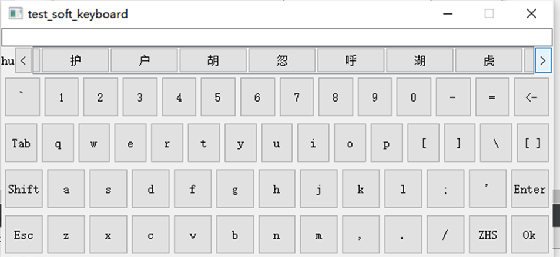

用qwidget做的软键盘

目前  仅支持**QLineEdit**  **QPlainTextEdit**

只需要移植FullKeyboard.h  FullKeyboard.cpp han_character_frequency.db  三个文件即可

能拼音输入

可在嵌入式(arm)上运行

部署的时候一定要带上拼音数据库文件("han_character_frequency.db")

查看han_character_frequency.txt可以看到所有的拼音数据

需要在项目文件(.pro)添加QT += sql

拼音数据来自[Chinese character frequency list 汉字字频表 (mtsu.edu)](https://lingua.mtsu.edu/chinese-computing/statistics/char/list.php?Which=TO)

